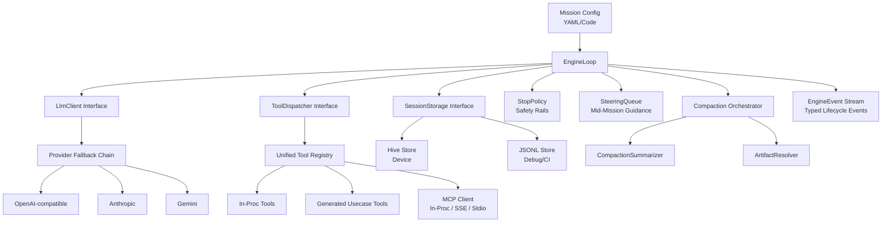

**zuraffa_agent** is the agent engine of the Zuraffa ecosystem — a Dart library for building autonomous, tool-using AI agents with persistent state, branching sessions, selective context compaction, and provider-agnostic LLM integration. It ships zero external agent-framework dependencies and targets Flutter-free environments (Dart VM, server, CLI).
Sources: [pubspec.yaml](pubspec.yaml#L1-L10), [lib/zuraffa_agent.dart](lib/zuraffa_agent.dart#L1-L10)

## Why zuraffa_agent Exists

Most agent frameworks collapse state into a monolithic blob, hardcode provider logic, and lack structural primitives for long-horizon missions. zuraffa_agent was built from first principles to solve three systemic problems:

1. **State granularity** — Every turn, message, tool call, and token count is a distinct typed entity, not a `Map<String, dynamic>` escape hatch. This enables reproducible replay, audit trails, and sub-agent isolation.
2. **Context economics** — Selective compaction preserves decisions, tool names, and key results while discarding verbose outputs via structured summaries and artifact references, extending viable trajectories from ~10 to 50+ iterations.
3. **Provider sovereignty** — The engine owns its provider clients (OpenAI-compatible, Anthropic, Gemini) behind a single `LlmClient` interface with a fallback chain and circuit breaker, so one provider outage never kills a mission.
Sources: [specs/001-state-and-sessions/spec.md](specs/001-state-and-sessions/spec.md#L30-L55), [specs/002-engine-core-loop/spec.md](specs/002-engine-core-loop/spec.md#L40-L65), [specs/004-providers-and-fallback/spec.md](specs/004-providers-and-fallback/spec.md#L25-L50)

## Architectural Overview

The engine decomposes into six vertically integrated layers, each with a single responsibility and a narrow interface:



Sources: [lib/src/engine/engine_loop.dart](lib/src/engine/engine_loop.dart#L30-L80), [lib/src/providers.dart](lib/src/providers.dart#L10-L80), [lib/src/tools.dart](lib/src/tools.dart#L10-L50), [lib/src/session_storage.dart](lib/src/session_storage.dart#L10-L50), [lib/src/compaction.dart](lib/src/compaction.dart#L10-L80)

## Core Capabilities Matrix

| Capability | Specification | Key Types | Status |
|------------|---------------|-----------|--------|
| **Granular Typed State** | Spec 001 | `AgentMessage`, `TurnRecord`, `ToolInvocationRecord`, `UsageLedgerEntry`, `CompactionEntry` | ✅ Implemented |
| **Branching Session Trees** | Spec 001 | `AgentSession`, `SessionTreeEntry`, `BranchSummaryEntry` | ✅ Implemented |
| **Dual Persistence (Hive + JSONL)** | Spec 001 | `SessionStorage`, `HiveSessionStore`, `JsonlSessionStorage` | ✅ Implemented |
| **Selective Compaction** | Spec 001 | `CompactionSettings`, `CompactionSummary`, `ArtifactRef` | ✅ Implemented |
| **Turn-Based Engine Loop** | Spec 002 | `EngineLoop`, `EngineConfig`, `MissionConfig` | ✅ Implemented |
| **Interleaved Thinking Preservation** | Spec 002 | `ThinkingBlock`, `EngineEvent` hierarchy | ✅ Implemented |
| **Mid-Mission Steering** | Spec 002 | `SteeringQueue`, `SteeringMessage` | ✅ Implemented |
| **Safety Rails (Turns/Timeout/Repetition)** | Spec 002 | `StopPolicy`, `LoopDetected`, `MaxTurnsExceeded` | ✅ Implemented |
| **Typed Event Stream** | Spec 002 | `EngineEvent` (sealed hierarchy) | ✅ Implemented |
| **Unified Tool Registry** | Spec 003 | `AgentTool`, `ToolDispatcher`, `McpTransport` | 🚧 In Progress |
| **Risk Tiers (safe/confirm/admin)** | Spec 003 | Tool metadata + approval callbacks | 🚧 In Progress |
| **MCP Client (3 Transports)** | Spec 003 | `McpTransport` sealed: InProc, Sse, Stdio | 🚧 In Progress |
| **ArtifactRef for Large Results** | Spec 003 | `ToolResult` with `artifactRef` | 🚧 In Progress |
| **Provider Clients (3 Protocols)** | Spec 004 | `LlmClient` implementations | 🚧 In Progress |
| **Fallback Chain + Circuit Breaker** | Spec 004 | `FallbackChain`, `ClientHealth` | 🚧 In Progress |
| **Usage Ledger Accounting** | Spec 004 | `UsageLedgerEntry` per call | 🚧 In Progress |
| **Sub-Agent Dispatch** | Spec 005 | `SubAgentType`, `DispatchTool` | 📋 Planned |
| **Declarative YAML Agent Specs** | Spec 005 | `AgentSpec` with `extends` inheritance | 📋 Planned |
| **Eval Harness + Goldens** | Spec 006 | Golden fixture replay | 📋 Planned |

Sources: [specs/001-state-and-sessions/spec.md](specs/001-state-and-sessions/spec.md#L60-L90), [specs/002-engine-core-loop/spec.md](specs/002-engine-core-loop/spec.md#L70-L100), [specs/003-tools-and-mcp/spec.md](specs/003-tools-and-mcp/spec.md#L50-L80), [specs/004-providers-and-fallback/spec.md](specs/004-providers-and-fallback/spec.md#L55-L85), [specs/005-subagents-and-declarative/spec.md](specs/005-subagents-and-declarative/spec.md#L55-L85)

## Project Structure

```
lib/
├── zuraffa_agent.dart           # Public exports barrel
├── src/
│   ├── types.dart               # Re-exports all Zorphy-generated entities
│   ├── session.dart             # AgentSession — tree navigation, branching, context reconstruction
│   ├── session_storage.dart     # Abstract SessionStorage interface
│   ├── session_storage_impl.dart# InMemorySessionStorage implementation
│   ├── jsonl_session_storage.dart # JSONL file persistence with tear recovery
│   ├── hive_session_store.dart  # Hive CE persistence for device
│   ├── hive_adapters.dart       # Hive type adapters for all entities
│   ├── compaction.dart          # Selective compaction orchestration
│   ├── usage_ledger.dart        # Token accounting utilities
│   ├── providers.dart           # LlmClient interface + fallback resolver
│   ├── tools.dart               # AgentTool, ToolDispatcher, JSON-Schema validation
│   ├── skills.dart              # SKILL.md discovery + system prompt formatting
│   ├── engine/
│   │   ├── engine_loop.dart     # Turn-based mission executor
│   │   ├── steering.dart        # SteeringQueue for mid-mission injection
│   │   └── stop_policy.dart     # Safety rails: maxTurns, timeout, repetition
│   ├── domain/
│   │   └── entities/            # Zorphy-generated entity types (13 entities)
│   └── di/                      # Service locator + repository/usecase wiring
```

Sources: [lib/zuraffa_agent.dart](lib/zuraffa_agent.dart#L1-L19), [lib/src/types.dart](lib/src/types.dart#L1-L30), [run_bash output](find lib/src -name "*.dart" | wc -l)

## Key Design Principles

| Principle | Implementation |
|-----------|----------------|
| **Zorphy-generated entities** | All state types are code-generated from schema (constitution IX); no hand-written serialization |
| **Flutter-free runtime** | Pure Dart; no Flutter dependencies (constitution VII) |
| **Interface-segregated layers** | `LlmClient`, `ToolDispatcher`, `SessionStorage`, `CompactionSummarizer` — each replaceable |
| **Provider-agnostic loop** | Engine knows only `LlmClient.generate/stream`; providers are plugins |
| **Event-sourced session tree** | Every mutation appends an entry; `buildContext()` reconstructs by walking parent links |
| **Selective over naive compaction** | Heuristic token estimation → cut point → structured summary + artifactRefs |
| **Deterministic replay** | Same inputs + recorded LLM → byte-identical event streams (Spec 002 SC-004) |

Sources: [specs/001-state-and-sessions/spec.md](specs/001-state-and-sessions/spec.md#L95-L110), [lib/src/session.dart](lib/src/session.dart#L10-L80), [lib/src/engine/engine_loop.dart](lib/src/engine/engine_loop.dart#L100-L150)

## Quick Start Path

For beginners, follow this progression through the documentation:

1. **[Quick Start](2-quick-start)** — Install dependencies, run a hello-world mission with the in-memory store and mock LLM
2. **[Architecture & Design Philosophy](3-architecture-and-design-philosophy)** — Deep dive into the entity model, session tree mechanics, and compaction strategy
3. **Provider Setup** — Configure real LLM clients (OpenAI-compatible / Anthropic / Gemini) — see Spec 004
4. **Tool Integration** — Register in-proc tools or connect MCP servers — see Spec 003
5. **Advanced Patterns** — Branching sessions, steering, sub-agents, declarative specs — see Specs 005-006

Each layer builds on the previous; the engine loop (Spec 002) consumes the session layer (Spec 001), which feeds tools (Spec 003) and providers (Spec 004), enabling sub-agents (Spec 005) and evaluation (Spec 006).

## Testing & Quality

- **137 source files** across `lib/src/` covering all six specification areas
- **12 test files** exercising storage round-trips, engine loop determinism, compaction logic, and entity serialization
- **Contract tests** for provider clients (Spec 004) and tool dispatch (Spec 003) using recorded fixtures
- **Golden fixture** `test/fixtures/mission_50.jsonl` — a 50+ tool-call mission validating compaction under budget
Sources: [test/session_storage_test.dart](test/session_storage_test.dart#L1-L50), [test/engine/engine_loop_test.dart](test/engine/engine_loop_test.dart#L1-L80), [test/fixtures/mission_50.jsonl](test/fixtures/mission_50.jsonl)

## Next Steps

| If you want to... | Start here |
|-------------------|------------|
| Run your first mission in 5 minutes | [Quick Start](2-quick-start) |
| Understand the entity model and session tree | [Architecture & Design Philosophy](3-architecture-and-design-philosophy) |
| Integrate a real LLM provider | Spec 004: Providers & Fallback Chain |
| Add custom tools or connect MCP servers | Spec 003: Tools & MCP Client |
| Build multi-agent workflows | Spec 005: Sub-agents & Declarative Specs |

The specifications in `specs/` are the source of truth for each capability — they define acceptance criteria, edge cases, and measurable success criteria that the implementation must satisfy.