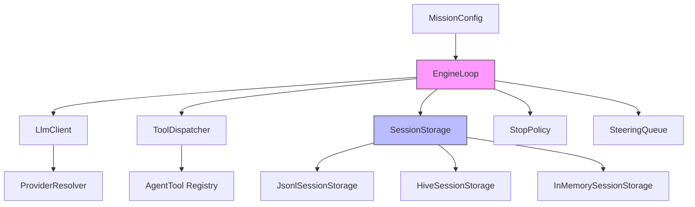
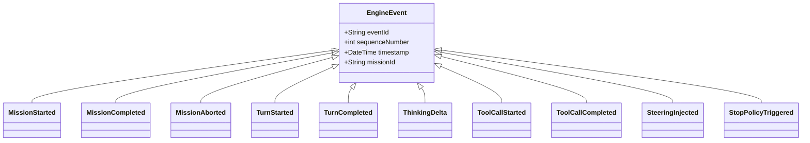

Get a working agent mission running in under five minutes. This guide walks through installation, core concepts, and a minimal end-to-end example that demonstrates session persistence, tool dispatch, and the engine loop.

Sources: [pubspec.yaml](pubspec.yaml#L1-L29), [lib/zuraffa_agent.dart](lib/zuraffa_agent.dart#L1-L19)

## Prerequisites

| Requirement | Version | Notes |
|-------------|---------|-------|
| Dart SDK | ^3.8.0 | `dart --version` to verify |
| Git | Any | For dependency resolution |
| Internet | Required | Fetches `zuraffa` from GitHub |

Install Dart via [dart.dev](https://dart.dev/get-dart) or your package manager (`brew install dart` on macOS).

## Installation

```bash
# Clone and enter the repository
git clone https://github.com/arrrrny/zuraffa_agent.git
cd zuraffa_agent

# Resolve dependencies (fetches zuraffa from GitHub development branch)
dart pub get

# Generate Zorphy entity code (required for typed entities)
dart run build_runner build --delete-conflicting-outputs

# Verify the setup
dart analyze --fatal-infos
dart test
```

The `build_runner` step generates `.zorphy.dart` files under `lib/src/domain/entities/**` — these are the typed entity classes that power the session tree.

Sources: [pubspec.yaml](pubspec.yaml#L15-L28), [build.yaml](build.yaml#L1-L20), [scripts/bootstrap.sh](scripts/bootstrap.sh#L1-L13)

## Architecture at a Glance



**Core Components**:

| Component | Purpose | Key Types |
|-----------|---------|-----------|
| `EngineLoop` | Turn-based execution engine | `EngineConfig`, `MissionResult`, `EngineEvent` stream |
| `AgentSession` | High-level session tree manager | `SessionContext`, `SessionTreeEntry` hierarchy |
| `SessionStorage` | Persistence abstraction | `JsonlSessionStorage`, `HiveSessionStorage`, `InMemorySessionStorage` |
| `LlmClient` | Provider-agnostic LLM interface | `LlmResponse`, `LlmResponseChunk`, `ToolCall` |
| `ToolDispatcher` | Tool execution with JSON-Schema validation | `AgentTool`, `validateParameters` |
| `ProviderResolver` | Multi-provider model fallback | `ProviderConfig`, `ResolvedModel` |

Sources: [lib/zuraffa_agent.dart](lib/zuraffa_agent.dart#L1-L19), [lib/src/engine/engine_loop.dart](lib/src/engine/engine_loop.dart#L1-L80), [lib/src/session.dart](lib/src/session.dart#L1-L50), [lib/src/session_storage.dart](lib/src/session_storage.dart#L1-L55), [lib/src/providers.dart](lib/src/providers.dart#L1-L80), [lib/src/tools.dart](lib/src/tools.dart#L1-L40)

## Minimal Working Example

Create `quickstart.dart`:

```dart
import 'package:zuraffa_agent/zuraffa_agent.dart';

/// In-memory LLM client that returns a fixed response.
class FakeLlmClient implements LlmClient {
  final List<LlmResponse> _responses;
  int _index = 0;

  FakeLlmClient(this._responses);

  @override
  Future<LlmResponse> generate({
    required List<Map<String, dynamic>> messages,
    required List<Map<String, dynamic>> tools,
    required Map<String, dynamic> config,
  }) async => _responses[_index++ % _responses.length];

  @override
  Stream<LlmResponseChunk> stream({
    required List<Map<String, dynamic>> messages,
    required List<Map<String, dynamic>> tools,
    required Map<String, dynamic> config,
  }) async* {
    final response = await generate(
      messages: messages,
      tools: tools,
      config: config,
    );
    yield LlmResponseChunk(
      content: response.content,
      thinking: null,
      toolCalls: response.toolCalls,
      usage: response.usage,
      isComplete: true,
      finishReason: response.finishReason,
    );
  }

  @override
  Future<void> close() async {}
}

/// In-memory tool dispatcher with a single echo tool.
class FakeToolDispatcher implements ToolDispatcher {
  @override
  Future<String> dispatch(String toolName, Map<String, dynamic> arguments) async {
    if (toolName == 'echo') {
      return 'Echo: ${arguments['message']}';
    }
    throw ToolNotFoundException(toolName);
  }
}

void main() async {
  // 1. Configure the mission
  final missionConfig = MissionConfig(
    missionId: 'quickstart-001',
    initialPrompt: 'Say hello using the echo tool',
    availableTools: ['echo'],
    metadata: {},
  );

  // 2. Define the echo tool (JSON Schema for validation)
  final echoTool = AgentTool<Map<String, dynamic>, String>(
    name: 'echo',
    description: 'Returns the input message prefixed with "Echo: "',
    inputSchema: {
      'type': 'object',
      'properties': {
        'message': {'type': 'string', 'description': 'Message to echo'}
      },
      'required': ['message'],
    },
    execute: (params) async => 'Echo: ${params['message']}',
  );

  // 3. Wire up dependencies
  final llmClient = FakeLlmClient([
    // Turn 1: LLM calls the echo tool
    LlmResponse(
      content: '',
      toolCalls: [
        ToolCall(
          id: 'call-1',
          name: 'echo',
          arguments: {'message': 'Hello from Quick Start!'},
        ),
      ],
      usage: LlmUsage(inputTokens: 50, outputTokens: 20),
      finishReason: 'tool_calls',
    ),
    // Turn 2: LLM produces final answer
    LlmResponse(
      content: 'The tool responded: Echo: Hello from Quick Start!',
      toolCalls: [],
      usage: LlmUsage(inputTokens: 30, outputTokens: 15),
      finishReason: 'stop',
    ),
  ]);

  final toolDispatcher = FakeToolDispatcher();

  // 4. Create and run the engine
  final engine = EngineLoop(EngineConfig(
    missionConfig: missionConfig,
    llmClient: llmClient,
    toolDispatcher: toolDispatcher,
    stopPolicy: defaultPolicy().copyWith(maxTurns: 5),
  ));

  print('🚀 Starting mission: ${missionConfig.missionId}');
  final result = await engine.executeMission();

  // 5. Inspect results
  print('✅ Mission completed: ${result.finalOutcome}');
  print('🔄 Total turns: ${result.totalTurns}');
  print('📋 Events emitted: ${result.events.length}');
  
  for (final event in result.events) {
    print('  • ${event.runtimeType} (seq: ${event.sequenceNumber})');
  }

  await llmClient.close();
}
```

Run it:

```bash
dart run quickstart.dart
```

**Expected Output**:

```
🚀 Starting mission: quickstart-001
✅ Mission completed: success
🔄 Total turns: 2
📋 Events emitted: 8
  • MissionStarted (seq: 1)
  • TurnStarted (seq: 2)
  • ToolCallStarted (seq: 3)
  • ToolCallCompleted (seq: 4)
  • TurnCompleted (seq: 5)
  • TurnStarted (seq: 6)
  • TurnCompleted (seq: 7)
  • MissionCompleted (seq: 8)
```

Sources: [lib/src/engine/engine_loop.dart](lib/src/engine/engine_loop.dart#L50-L120), [lib/src/providers.dart](lib/src/providers.dart#L1-L60), [lib/src/tools.dart](lib/src/tools.dart#L1-L30), [lib/src/engine/stop_policy.dart](lib/src/engine/stop_policy.dart#L1-L35)

## Session Persistence Quick Start

The `AgentSession` class provides a high-level API for managing conversation trees with branching, forking, and context reconstruction.

```dart
import 'package:zuraffa_agent/zuraffa_agent.dart';

void main() async {
  // 1. Choose a storage backend
  final storage = JsonlSessionStorage('my_session.jsonl');
  // Or: HiveSessionStorage(boxName: 'my_session')
  // Or: InMemorySessionStorage() for testing

  // 2. Create session and initialize
  final session = AgentSession(storage);
  await session.init();

  // 3. Append messages (user/assistant/system)
  await session.appendMessage(UserMessage.text('What is 2 + 2?'));
  await session.appendMessage(AssistantMessage.text('4'));
  await session.appendMessage(UserMessage.text('What about 3 + 3?'));

  // 4. Record tool invocations
  await session.appendToolInvocation(
    ToolInvocationRecord(
      id: 'tool-1',
      name: 'calculator',
      arguments: {'expression': '3 + 3'},
      result: '6',
    ),
    arguments: {'expression': '3 + 3'},
  );

  // 5. Track token usage
  await session.appendUsage(
    UsageLedgerEntry(
      id: 'usage-1',
      inputTokens: 100,
      outputTokens: 50,
      totalTokens: 150,
    ),
    model: Model(provider: 'openai', modelId: 'gpt-4o', contextWindow: 128000),
  );

  // 6. Reconstruct context for the active branch
  final context = await session.buildContext();
  print('Messages in context: ${context.messages.length}');
  print('Active model: ${context.activeModel?.modelId}');

  // 7. Fork the conversation at a specific entry
  await session.fork('entry-id-to-fork-from');

  // 8. Persist and close
  await storage.close();
}
```

**Storage Backend Comparison**:

| Backend | Use Case | Persistence | Performance |
|---------|----------|-------------|-------------|
| `InMemorySessionStorage` | Unit tests, ephemeral sessions | ❌ | Fastest |
| `JsonlSessionStorage` | Human-readable, debugging, portability | ✅ JSONL file | Good (streaming append) |
| `HiveSessionStorage` | Production mobile/desktop, large datasets | ✅ Binary KV | Fastest persistent |

Sources: [lib/src/session.dart](lib/src/session.dart#L1-L80), [lib/src/session_storage.dart](lib/src/session_storage.dart#L1-L55), [lib/src/jsonl_session_storage.dart](lib/src/jsonl_session_storage.dart#L1-L50), [lib/src/hive_session_store.dart](lib/src/hive_session_store.dart#L1-L74), [lib/src/session_storage_impl.dart](lib/src/session_storage_impl.dart#L1-L54)

## Engine Events & Streaming

The `EngineLoop` emits a typed event stream for observability and UI integration:

```dart
final engine = EngineLoop(EngineConfig(...));

// Subscribe to real-time events
engine.events.listen((event) {
  switch (event) {
    case MissionStarted():
      print('🎬 Mission ${event.missionId} started');
    case TurnStarted():
      print('🔄 Turn ${event.turnNumber} started');
    case ThinkingDelta():
      print('💭 Thinking: ${event.thinking}');
    case ToolCallStarted():
      print('🔧 Tool ${event.toolCall.name} started');
    case ToolCallCompleted():
      print('✅ Tool ${event.toolCall.name} completed: ${event.result}');
    case TurnCompleted():
      print('🏁 Turn ${event.turnNumber} completed');
    case MissionCompleted():
      print('🎉 Mission ${event.outcome} (${event.totalTurns} turns)');
    case MissionAborted():
      print('⚠️ Mission aborted: ${event.reason}');
  }
});

final result = await engine.executeMission();
```

**Event Hierarchy**:



Sources: [lib/src/engine/engine_loop.dart](lib/src/engine/engine_loop.dart#L120-L200), [lib/src/domain/entities/engine_event/engine_event.dart](lib/src/domain/entities/engine_event/engine_event.dart)

## Safety Rails: StopPolicy

Configure bounds to prevent runaway loops:

```dart
final stopPolicy = StopPolicy(
  maxTurns: 50,                    // Hard limit on turns
  wallClockTimeoutMs: 300000,      // 5-minute wall clock
  repetitionThreshold: 3,          // Detect repeated tool patterns
  enabled: true,
);

// Or use the default and customize
final customPolicy = defaultPolicy().copyWith(
  maxTurns: 100,
  wallClockTimeoutMs: 600000,
);
```

The engine emits `StopPolicyTriggered` events when limits are hit and completes with typed outcomes: `max_turns_exceeded`, `timeout`, or `loop_detected`.

Sources: [lib/src/engine/stop_policy.dart](lib/src/engine/stop_policy.dart#L1-L35), [lib/src/engine/engine_loop.dart](lib/src/engine/engine_loop.dart#L200-L280)

## Steering: Mid-Mission Course Correction

Inject guidance without restarting:

```dart
final engine = EngineLoop(EngineConfig(...));

// Start mission in background
final missionFuture = engine.executeMission();

// Later, inject steering before turn 3
engine.injectSteering(
  'Focus only on retrieving data, do not analyze.',
  injectionPoint: 3, // Inject before turn 3
);

// Wait for completion
final result = await missionFuture;
```

The `SteeringQueue` manages FIFO ordering and drains messages at the correct turn boundary.

Sources: [lib/src/engine/steering.dart](lib/src/engine/steering.dart#L1-L73), [lib/src/engine/engine_loop.dart](lib/src/engine/engine_loop.dart#L280-L350)

## Project Structure

```
lib/
├── zuraffa_agent.dart           # Public exports
├── src/
│   ├── types.dart               # Entity exports, ContentBlock hierarchy, ID generation
│   ├── session.dart             # AgentSession, SessionContext, tree operations
│   ├── session_storage.dart     # SessionStorage interface
│   ├── session_storage_impl.dart# InMemorySessionStorage
│   ├── jsonl_session_storage.dart  # JSONL file backend
│   ├── hive_session_store.dart  # Hive binary backend
│   ├── hive_adapters.dart       # Hive type adapters
│   ├── providers.dart           # LlmClient, ProviderResolver, LlmResponse
│   ├── tools.dart               # AgentTool, ToolDispatcher, JSON-Schema validation
│   ├── skills.dart              # Skill discovery & system prompt formatting
│   ├── compaction.dart          # Context compaction logic
│   ├── usage_ledger.dart        # Token accounting
│   ├── engine/
│   │   ├── engine_loop.dart     # Main EngineLoop implementation
│   │   ├── steering.dart        # SteeringQueue, SteeringMessage
│   │   └── stop_policy.dart     # StopPolicy extensions
│   └── domain/entities/         # Zorphy-generated typed entities
```

Sources: [lib/zuraffa_agent.dart](lib/zuraffa_agent.dart#L1-L19), [get_dir_structure](.)

## Running Tests

```bash
# All tests
dart test

# Specific suites
dart test test/engine/           # Engine loop tests
dart test test/session_storage_test.dart  # Session storage tests
dart test test/roundtrip_test.dart        # Entity round-trip tests
dart test test/types_test.dart            # Type system tests
dart test test/compaction_test.dart       # Compaction tests

# With coverage
dart test --coverage=coverage
```

Sources: [test/](test/), [specs/001-state-and-sessions/quickstart.md](specs/001-state-and-sessions/quickstart.md#L1-L50), [specs/002-engine-core-loop/quickstart.md](specs/002-engine-core-loop/quickstart.md#L1-L100)

## Next Steps

| Goal | Read Next |
|------|-----------|
| Understand the architectural philosophy | [Architecture & Design Philosophy](3-architecture-and-design-philosophy) |
| Deep dive into session tree mechanics | [State & Sessions Spec](specs/001-state-and-sessions/spec.md) |
| Learn the engine loop internals | [Engine Core Loop Spec](specs/002-engine-core-loop/spec.md) |
| Build custom tools & MCP integration | [Tools & MCP Spec](specs/003-tools-and-mcp/spec.md) |
| Configure multi-provider fallbacks | [Providers & Fallback Spec](specs/004-providers-and-fallback/spec.md) |

Sources: [specs/](specs/)

## Troubleshooting

| Issue | Cause | Resolution |
|-------|-------|------------|
| `dart pub get` fails on `zuraffa` git dep | Network/auth | Ensure GitHub access; try `git clone` manually |
| `build_runner` generates nothing | Missing annotations | Check `zorphy_annotation` in `pubspec.yaml`; run with `--delete-conflicting-outputs` |
| `dart analyze --fatal-infos` fails | Lint violations | Fix reported issues; common: missing return types, unused imports |
| `ToolNotFoundException` at runtime | Tool not registered | Ensure tool name in `MissionConfig.availableTools` matches `AgentTool.name` |
| Mission hangs | No stop policy | Always provide `StopPolicy` with `maxTurns` and `wallClockTimeoutMs` |
| JSONL corruption on crash | Unflushed writes | Call `storage.close()`; `JsonlSessionStorage` auto-recovers on reopen |

---

*Ready to go deeper? Continue to [Architecture & Design Philosophy](3-architecture-and-design-philosophy) for the system's foundational principles.*