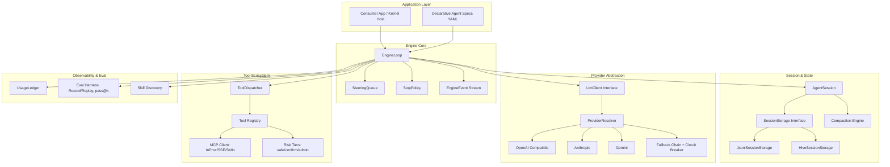
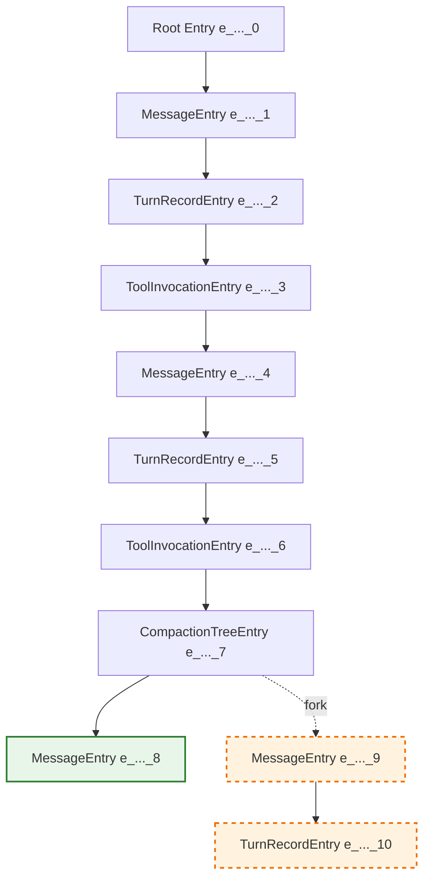
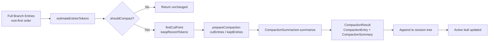
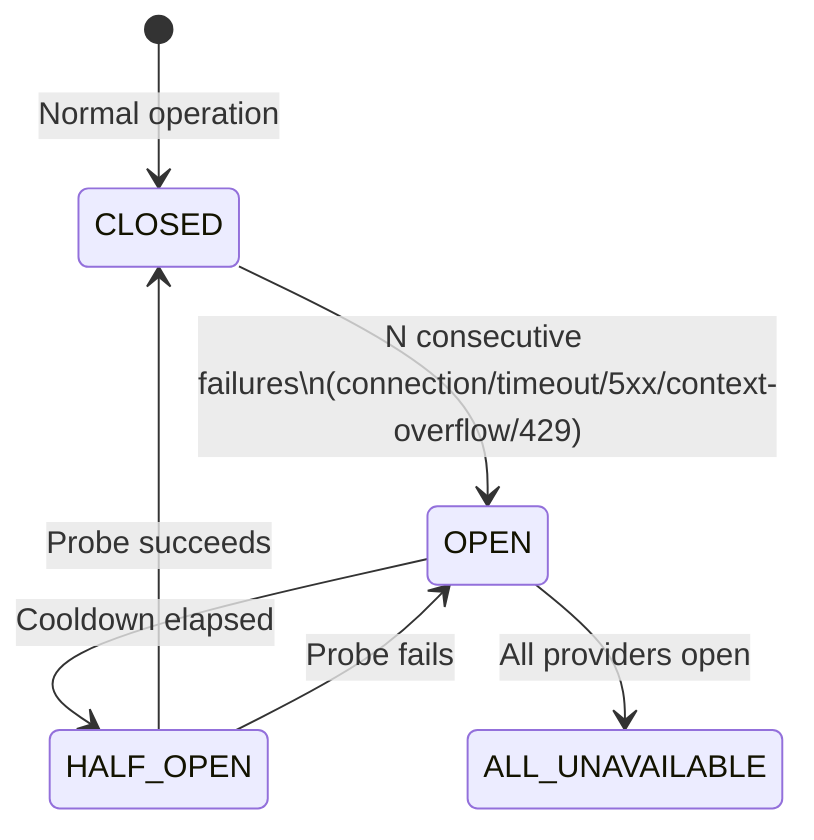

Welcome to the architectural foundation of **zuraffa_agent** — the agent engine powering the Zuraffa ecosystem. This document explains the **why** behind the system's structure: the guiding principles, core patterns, and design decisions that shape every component. Whether you're extending the engine, integrating it into an application, or contributing to its evolution, this philosophy provides the mental model for reasoning about the codebase.

---

## The Core Vision: Granular, Composable, Resumable

zuraffa_agent was built to solve a fundamental problem in agent systems: **monolithic state blobs that cannot be inspected, branched, or compacted intelligently**. The engine rejects the "single AgentState object" anti-pattern in favor of **granular typed entities** — each turn, message, tool invocation, and usage record exists as an independent, Zorphy-generated type with full serialization fidelity.

This philosophy manifests in three architectural pillars:

| Pillar | What It Means | Why It Matters |
|--------|---------------|----------------|
| **Granular Entities** | Every state unit is a distinct typed entity (TurnRecord, ToolInvocationRecord, UsageLedgerEntry, CompactionEntry, Model, etc.) | Enables independent retrieval, precise compaction, auditability, and type-safe evolution |
| **Branching Session Trees** | Sessions form a persistent tree of entries with first-class fork/switch/resume | Supports sub-agents, exploration strategies, and deterministic replay without context pollution |
| **Selective Compaction** | Context budgets managed via structured summaries + artifact references, never naive truncation | Extends viable mission length from ~10 to 50+ turns while preserving decision chains |

These pillars are not independent — they **compose**. The session tree stores granular entities; compaction operates on tree slices; sub-agents spawn isolated trees; the eval harness replays trees deterministically.

---

## System Architecture Overview

The following diagram illustrates the high-level component relationships and data flows:



**Data Flow Summary**: The `EngineLoop` drives turns by requesting completions from the `LlmClient` (resolved via `ProviderResolver` with fallback), dispatches tool calls through the `ToolDispatcher` (backed by a unified registry with MCP support), persists every granular event to `SessionStorage` (JSONL or Hive), and emits a typed `EngineEvent` stream for consumers. When context pressure builds, the `Compaction` engine selectively summarizes older tree slices while preserving decisions and tool chains.

Sources: [lib/src/engine/engine_loop.dart](lib/src/engine/engine_loop.dart#L1-L100), [lib/src/providers.dart](lib/src/providers.dart#L1-L100), [lib/src/session.dart](lib/src/session.dart#L1-L100), [lib/src/compaction.dart](lib/src/compaction.dart#L1-L100), [lib/src/tools.dart](lib/src/tools.dart#L1-L80)

---

## Design Principle 1: Granular Typed Entities (No State Blobs)

### The Problem
Traditional agent frameworks accumulate state into a single `AgentState` or `Conversation` object. This creates three pathologies:
1. **Opacity** — You cannot query "show me all tool invocations for turn 3" without deserializing the entire blob.
2. **Compaction Blindness** — Truncation must guess what to keep; structured summarization is impossible.
3. **Evolution Fragility** — Schema changes break the entire state; migrations are all-or-nothing.

### The zuraffa_agent Solution
Every state unit is a **Zorphy-generated entity** with:
- **Stable identity** (`id: String` — base36 timestamp + sequence for monotonic ordering)
- **Explicit parentage** (`parentId: String` — enables tree reconstruction)
- **Full JSON serialization** (generated `toJson`/`fromJson` with zero `Map<String, dynamic>` escapes)
- **Value semantics** (equatable, comparable, immutable)

```mermaid
classDiagram
    class SessionTreeEntry {
        <<sealed>>
        +String id
        +String parentId
        +DateTime timestamp
    }
    class MessageEntry {
        +AgentMessage message
    }
    class TurnRecordEntry {
        +TurnRecord record
    }
    class ToolInvocationEntry {
        +ToolInvocationRecord record
        +Map<String, dynamic> arguments
        +List<ArtifactRef> artifactRefs
    }
    class UsageEntry {
        +UsageLedgerEntry record
        +Model? model
    }
    class CompactionTreeEntry {
        +CompactionEntry record
        +CompactionSummary summary
    }
    class ThinkingLevelEntry {
        +ThinkingLevelChangeEntry record
    }
    class ModelChangeEntry {
        +ModelChangeEntry record
    }
    class BranchSummaryTreeEntry {
        +BranchSummaryEntry record
    }
    class LabelTreeEntry {
        +LabelEntry record
    }
    class CustomTreeEntry {
        +CustomEntry record
    }

    SessionTreeEntry <|-- MessageEntry
    SessionTreeEntry <|-- TurnRecordEntry
    SessionTreeEntry <|-- ToolInvocationEntry
    SessionTreeEntry <|-- UsageEntry
    SessionTreeEntry <|-- CompactionTreeEntry
    SessionTreeEntry <|-- ThinkingLevelEntry
    SessionTreeEntry <|-- ModelChangeEntry
    SessionTreeEntry <|-- BranchSummaryTreeEntry
    SessionTreeEntry <|-- LabelTreeEntry
    SessionTreeEntry <|-- CustomTreeEntry
```



**Key Insight**: The sealed `SessionTreeEntry` hierarchy means the session tree is **heterogeneous but type-safe**. `AgentSession.buildContext()` pattern-matches on entry types to reconstruct exactly the conversation context the model needs — messages, active model, thinking level, and compaction summary — while ignoring metadata entries (turn records, tool invocations, usage, labels) that don't belong in the LLM context.

Sources: [lib/src/types.dart](lib/src/types.dart#L1-L150), [lib/src/session.dart](lib/src/session.dart#L1-L150), [specs/001-state-and-sessions/spec.md](specs/001-state-and-sessions/spec.md#L1-L50)

---

## Design Principle 2: Branching Session Trees with Fork/Resume

### The Model
A session is a **tree of entries** where each entry points to its parent. A single **active leaf pointer** tracks the current branch head. This is the same model pi_agent pioneered, ported and hardened for production.



### Fork Semantics
When `AgentSession.fork(atEntryId)` is called:
1. A `BranchSummaryEntry` is created at the fork point, recording the branch identity
2. The new branch shares **all ancestry entries** up to `atEntryId`
3. Subsequent appends create new entries with `parentId` pointing to the new leaf
4. Both branches remain fully resumable — `buildContext()` walks the parent chain from the respective leaf

### Switch/Resume
`AgentSession.switchBranch(leafId)` moves the active leaf pointer. `buildContext()` then reconstructs the conversation **exactly as it existed on that branch** — no cross-contamination, no lost history.

### Persistence Equivalence
Both `JsonlSessionStorage` (streaming JSONL with corrupt-tail recovery) and `HiveSessionStorage` (binary KV via `hive_ce`) implement the identical `SessionStorage` interface. The spec mandates **round-trip equivalence**: the same session tree persisted to both stores must yield identical branch structure and entries on reload.

Sources: [lib/src/session.dart](lib/src/session.dart#L100-L280), [lib/src/jsonl_session_storage.dart](lib/src/jsonl_session_storage.dart#L1-L140), [lib/src/hive_session_store.dart](lib/src/hive_session_store.dart#L1-L74), [specs/001-state-and-sessions/spec.md](specs/001-state-and-sessions/spec.md#L50-L80)

---

## Design Principle 3: Selective Compaction (Kimi-Researcher Pattern)

### The Challenge
Long missions hit context windows. Naive truncation (dropping oldest messages) destroys the **decision chain** — the model forgets *why* it chose a path, leading to repetition and drift.

### The Solution: Structured Selective Compaction
Compaction in zuraffa_agent is a **three-phase pipeline**:



### What Gets Preserved (The "Keep" Set)
- **Decisions**: Why a tool was chosen, what the model reasoned
- **Tool Names**: The sequence of capabilities invoked
- **Key Results**: Structured outcomes, not verbose payloads
- **Plan State**: Current task decomposition, next steps
- **Artifact References**: Pointers to full payloads stored externally

### What Gets Summarized (The "Cut" Set)
- Verbose tool outputs (large JSON, scraped pages, logs)
- Repetitive context (boilerplate system prompts, repeated instructions)
- Intermediate thinking that led to final decisions (the decision itself is kept)

### CompactionSummary Structure
The `CompactionSummary` entity captures:
- `decisions: List<String>` — high-level choices made
- `toolNames: List<String>` — tools invoked in the compacted range
- `keyResults: List<String>` — structured outcome summaries
- `artifactRefs: List<ArtifactRef>` — pointers to full payloads

This design directly implements the **Kimi-Researcher pattern** validated in production: missions that would die at 10 turns sustain 50+ turns with **no outcome regression** versus uncompacted baselines.

Sources: [lib/src/compaction.dart](lib/src/compaction.dart#L1-L250), [specs/001-state-and-sessions/spec.md](specs/001-state-and-sessions/spec.md#L80-L100)

---

## Design Principle 4: Provider-Agnostic Engine Loop (Kimi Turn-Based Pattern)

### No Finite State Machines
The `EngineLoop` is a **turn-based while-loop** that advances on the model's `finishReason`:
- `tool_calls` → dispatch tools, append results, continue
- `stop` → mission complete
- `length` / `error` → handled by stop policy

This mirrors the **Kimi pattern**: the model *is* the state machine. The engine provides scaffolding (safety rails, steering, event emission) but does not impose an external FSM.

### Interleaved Thinking Preservation
Critical design decision: **thinking blocks are first-class `ContentBlock` variants** (`ThinkingBlock`) that persist in `AgentMessage` across turns. Evidence from Kimi K2 Thinking class shows dropping thinking degrades browse-style tasks ~40%. The engine:
1. Accumulates streaming thinking deltas into `_accumulatedThinking`
2. Packages complete thinking blocks into the assistant message
3. `buildContext()` includes thinking blocks in subsequent-turn context
4. Compaction preserves thinking summaries in `CompactionSummary`

### Mid-Mission Steering
The `SteeringQueue` provides a **FIFO injection mechanism** for human-in-the-loop guidance:
- Messages enqueued during turn N are injected before turn N+1's LLM call
- Follow-up messages at mission end can continue the loop instead of exiting
- No restart, no state loss — the session tree simply grows

### Safety Rails (StopPolicy)
Every mission is bounded by a `StopPolicy`:
| Parameter | Default | Purpose |
|-----------|---------|---------|
| `maxTurns` | 100 | Hard turn ceiling |
| `wallClockTimeoutMs` | 300,000 (5 min) | Real-time budget |
| `repetitionThreshold` | 3 | Detects identical tool-call cycles |
| `enabled` | true | Master switch |

Violations emit typed `EngineEvent` outcomes (`MaxTurnsExceeded`, `LoopDetected`, `WallClockTimeout`) — the session remains resumable.

Sources: [lib/src/engine/engine_loop.dart](lib/src/engine/engine_loop.dart#L100-L300), [lib/src/engine/steering.dart](lib/src/engine/steering.dart#L1-L73), [lib/src/engine/stop_policy.dart](lib/src/engine/stop_policy.dart#L1-L35), [specs/002-engine-core-loop/spec.md](specs/002-engine-core-loop/spec.md#L1-L80)

---

## Design Principle 5: Unified Tool Registry with Risk Tiers & MCP Symmetry

### Single Namespace, Multiple Sources
The tool registry serves three tool origins in one namespace:
1. **DDA-registered** (in-process, hand-written)
2. **Generated usecase tools** (from ZikZak plugin, `arrrrny/zuraffa#385`)
3. **Remote MCP tools** (via native MCP client)

Namespace collisions (e.g., two sources registering `webview.browse`) are resolved via **deterministic prefixing** with a warning event — never silent shadowing.

### Risk Tiers as First-Class Metadata
Every `AgentTool` carries a `riskTier: 'safe' | 'confirm' | 'admin'`:
- **safe** — executes immediately
- **confirm** — awaits approval callback; timeout/denial returns a structured denial result
- **admin** — denied on non-internal missions (requires elevated context)

This supersedes the old `dart_agent_core` approach where risk was external policy; now it's **intrinsic to the tool definition**.

### MCP Client: Three Transports, Zero Compromise
| Transport | Use Case | Key Features |
|-----------|----------|--------------|
| **InProc** | Device tools, zero-latency | Pass-by-reference with defensive arg copy; no serialization boundary |
| **SSE + Bearer** | Cloud tools (Raptorr) | Reconnect with backoff, auth callback for token rotation, mid-stream resilience |
| **Stdio** | Dev tooling, local servers | Process restart policy with bounded retries |

Full symmetry with Zuraffa's own `McpSseServer` (`arrrrny/zuraffa#384`) — the engine is both MCP client and server peer.

### Tool Result Size Discipline
Results exceeding a size threshold are **summarized + `artifactRef`'d** before entering model context. A 2 MB scrape becomes a structured summary with a retrievable artifact reference — the context window is never poisoned.

Sources: [lib/src/tools.dart](lib/src/tools.dart#L1-L162), [specs/003-tools-and-mcp/spec.md](specs/003-tools-and-mcp/spec.md#L1-L106)

---

## Design Principle 6: Vendored Providers with Fallback Chain & Circuit Breakers

### Zero External Agent Dependencies
The engine **vendors** provider clients (OpenAI-compatible, Anthropic, Gemini) from `dart_agent_core` with **attribution headers** — `dart_agent_core` does not appear in the dependency graph. This guarantees:
- No version conflicts with consumer applications
- Full ownership of protocol logic
- Auditability of every network interaction

### Fallback Chain with Circuit Breakers
The `FallbackChain` implements a **per-provider state machine**:



**Mid-stream failure policy**: If a stream fails after partial chunks, the chain either restarts on the next provider (configurable) or surfaces a typed failure — **never silently truncates**.

### Usage Accounting Integration
Every LLM call records a `UsageLedgerEntry` (input, output, cached tokens) into the session tree. The `UsageLedger` projection provides aggregate metrics and sub-ledgers by turn/model for budget tracking.

Sources: [lib/src/providers.dart](lib/src/providers.dart#L100-L209), [lib/src/usage_ledger.dart](lib/src/usage_ledger.dart#L1-L58), [specs/004-providers-and-fallback/spec.md](specs/004-providers-and-fallback/spec.md#L1-L104)

---

## Design Principle 7: Sub-Agents with Context Isolation (Kimi LaborMarket Pattern)

### The Core Insight
Sub-agents are **not** just more turns in the parent's context. They are **isolated session trees** with:
- Independent context windows
- Dedicated tool allowlists
- Separate budget profiles
- **Result-only return** to parent (internal chatter never pollutes parent context)

### Instance Lifecycle
```
Parent Mission
    │
    ├─► Dispatch "explore" sub-agent
    │       │
    │       ├─► Creates SubAgentInstance with own session tree
    │       ├─► Runs N turns with own allowlist/budget
    │       ├─► Persists session at each step (resumable)
    │       └─► Returns ResultSummary + ArtifactRefs
    │
    └─► Parent context receives ONLY the result
```

### Declarative Agent Specs (YAML)
Agents are defined as data, not code:
```yaml
# base-agent.yaml
name: research-base
systemPrompt: "You are a research assistant..."
tools: [web.search, web.fetch, file.read]
budget:
  maxTurns: 20
  maxTokens: 100000
subAgents: [explore, verify]

# deep-research.yaml
extends: base-agent
name: deep-research
tools: [web.search, web.fetch, file.read, code.exec]
budget:
  maxTurns: 50
  maxTokens: 500000
```
**Inheritance semantics**: Child specs inherit unspecified fields, override specified ones. Validation catches cycles, unknown tools, and missing references at load time.

This is the **strategic pattern**: ZikZak per-country playbooks become agent spec instances — one mechanism, two uses.

Sources: [specs/005-subagents-and-declarative/spec.md](specs/005-subagents-and-declarative/spec.md#L1-L105)

---

## Design Principle 8: Deterministic Eval Harness (Record/Replay + pass@k)

### Record Once, Replay Forever
The eval harness records **complete mission cassettes** — LLM responses keyed by request + tool results. Replay consumes recordings instead of live calls with **identical event order**. Input drift (prompt changes) is detected loudly — never silently passes.

### pass@k and pass^k Metrics
- **pass@k** (unbiased estimator): Probability that at least 1 of k samples passes
- **pass^k** (empirical): Fraction of tasks where all k samples pass
- CI gate enforces threshold before cohort rollout (Raptorr registry integration)

### Grader Matrix (Heterogeneous Outputs)
| Grader Type | Use Case | Determinism |
|-------------|----------|-------------|
| **Exact Match** | Code gen, structured output | Byte-equality |
| **Schema Validator** | JSON/API responses | JSON-Schema validity |
| **Model-as-Judge** | Creative, open-ended | Recorded judge responses |

### Portable Runtime
**Zero `dart:io` imports** in the eval runtime module — enforced by static analysis gate. Runs on any CI runner including web-adjacent contexts. CLI/loader layers are exempt.

Sources: [specs/006-eval-harness-golden/spec.md](specs/006-eval-harness-golden/spec.md#L1-L117)

---

## Cross-Cutting Architectural Concerns

### Constitution Compliance
The engine adheres to the Zuraffa Constitution (referenced in specs):
- **Article VII**: `dart:io` quarantined — only `jsonl_session_storage.dart` and `hive_session_store.dart` (via `hive_ce`) touch the filesystem
- **Article IX**: All entities Zorphy-generated — no hand-written serialization
- **Article VI**: Integration tests use `test/` with real storage backends; unit tests use `InMemorySessionStorage`

### Attribution & Provenance
Ported assets from `pi_agent` (MIT license) carry **attribution headers** in every file:
```dart
// Ported from pi_agent (https://github.com/badlogic/pi_agent)
// Original work Copyright (c) 2024 Mario Zechner
// Modified work Copyright (c) 2026 ZikZak AI / Ahmet TOK
// Licensed under the MIT License.
```
This is not ceremonial — it enables license compliance audits and honors upstream contributors.

### Dependency Minimalism
`pubspec.yaml` shows the philosophy: **direct dependencies only on infrastructure** (`hive_ce`, `json_annotation`, `zorphy_annotation`, `zuraffa` git ref). No agent frameworks, no provider SDKs — everything is vendored or interfaced.

Sources: [pubspec.yaml](pubspec.yaml#L1-L29), [lib/src/skills.dart](lib/src/skills.dart#L1-L30)

---

## Reading Progression

Now that you understand the architectural philosophy, here's the recommended path through the documentation:

| Next Step | Purpose |
|-----------|---------|
| [Overview](1-overview) | Project scope, capabilities, and ecosystem context |
| [Quick Start](2-quick-start) | Minimal working example: mission → engine → result |

For deep dives into specific subsystems, consult the feature specifications in `specs/`:
- **State & Sessions** (`specs/001-state-and-sessions/`) — entity model, storage, compaction
- **Engine Core Loop** (`specs/002-engine-core-loop/`) — turn execution, steering, safety
- **Tools & MCP** (`specs/003-tools-and-mcp/`) — registry, risk tiers, transports
- **Providers & Fallback** (`specs/004-providers-and-fallback/`) — clients, circuit breakers
- **Sub-agents & Declarative Specs** (`specs/005-subagents-and-declarative/`) — isolation, YAML specs
- **Eval Harness** (`specs/006-eval-harness-golden/`) — record/replay, pass@k, graders

---

## Summary: The Architectural Contract

zuraffa_agent makes a **compact set of strong guarantees**:

| Guarantee | Mechanism |
|-----------|-----------|
| **Type-safe state** | Zorphy-generated entities, sealed hierarchies, zero `Map<String, dynamic>` escapes |
| **Branch/resume fidelity** | Parent-linked entry tree, single active leaf, identical JSONL/Hive round-trips |
| **Context scalability** | Selective compaction with structured summaries + artifact refs |
| **Provider resilience** | Fallback chain with circuit breakers, mid-stream policy, health snapshots |
| **Tool safety** | Risk tiers intrinsic to tools, approval callbacks, size discipline |
| **Deterministic testing** | Record/replay cassettes, pass@k gates, portable runtime |
| **Composable isolation** | Sub-agents with independent trees, declarative spec inheritance |

These guarantees are not aspirational — they are **tested acceptance criteria** in the feature specifications. The code you read implements these contracts directly.

Welcome to the engine. Build on solid ground.